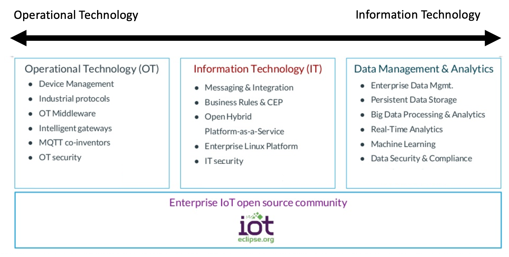
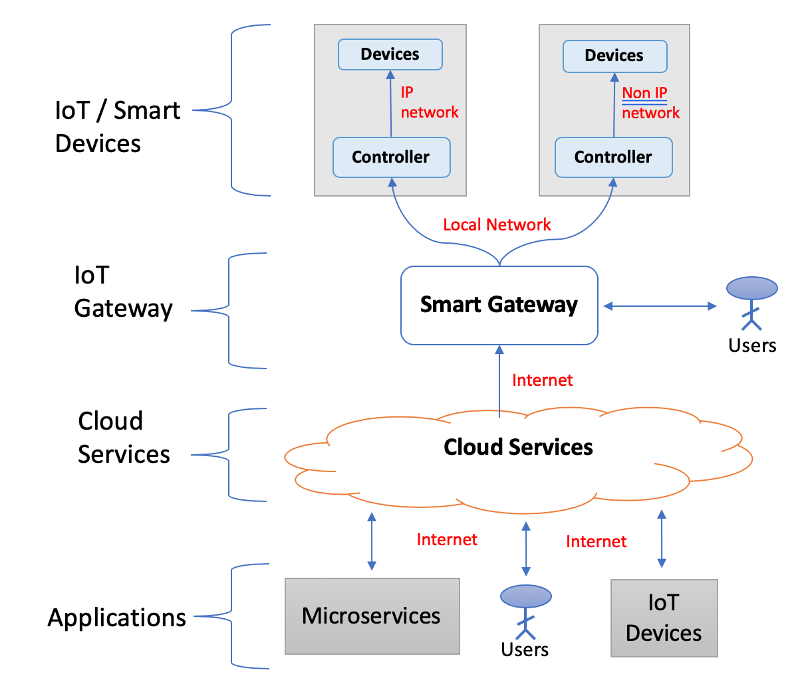

## Challeges with IoT Development

The exponential growth in "connected" applications and services (smart buildings, homes, and healthcare apps to name a few) has led to the development of the next generation of Internet of Things (IoT).

However, the use of IoT has also introduce several big challenges related to transferring, securing and storing the data being generated by these devices.  In addition there are also challenges with connnecting to the legacy infrastructure and private networks with their strigent security requirements.

Here is a highlevel IoT architecture that fits many of the next generation IoT aplications.  From Smart Home, to Smert Healthcare, the idea is to collect all the data possible from the IoT devices  (e.g., wearables, wireless sensor nertoworks, mobile devices, etc), analyze the mission critical data locally, and securely upload the insights and metaday into a secure repository in the cloud for additional analysis.

**Content Source**: [Highlevel IoT Edge Architecture](http://acl.ece.arizona.edu/projects/current/iot/index.html)

The data obtained from the IoT devices is is managed by our secure gateway where behavior analysis techniques are used to inspect the behavior of end nodes and to grant access to the systems locally or from the cloud.

 we are experiencing big challenges to secure and protect such advanced information services due to the significant increase in the amount of exploited systems; due to the increased attack surface. However, one of the major motivations for building ubiquitous connectivity to legacy infrastructures is the ability to build smart infrastructures to share resources and services. In this project, we will leverage the autonomic management and cyber security techniques being developed at the University of Arizona Center for Cloud and Autonomic Computing (CAC), to design a novel IoT architecture that is secure and resilient against cyber-attacks.

These advanced devices generate a tremendous amount of data

 

In this article we will explore some techniques for using containers to build iot application that can be used across different environments.  Using these techniques we will show you how you can use the same coding languages, frameworks, or tools for developing apps that will run in datacenters as well as on “edge” even if these apps must run on different CPU architectures.  In many cases, “Edge” computing nodes may run in remote datacenter or in multiple geo-distributed factories, ships, oil plants, and so on. 

## References

1. IoT edge development and deployment with containers through OpenShift: Part 1
1. [Iot Platform](https://dzone.com/articles/what-is-an-iot-platform)
