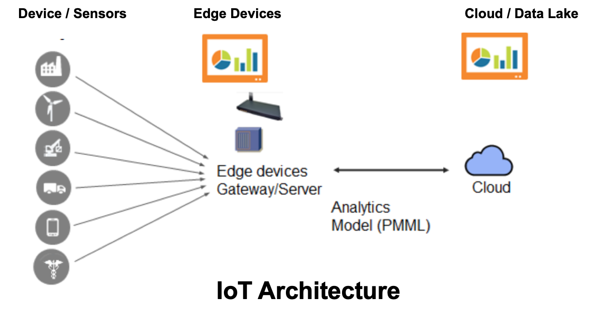
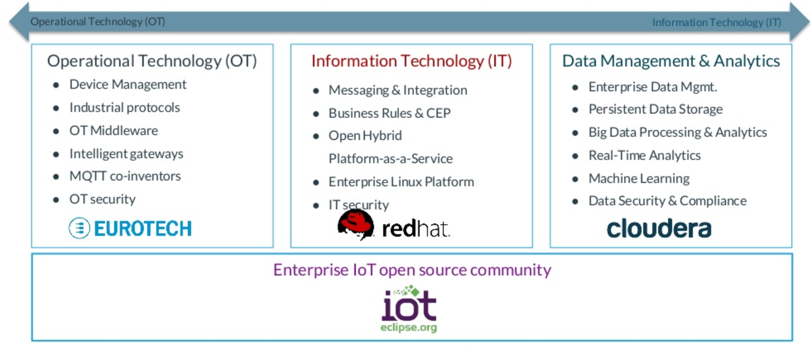
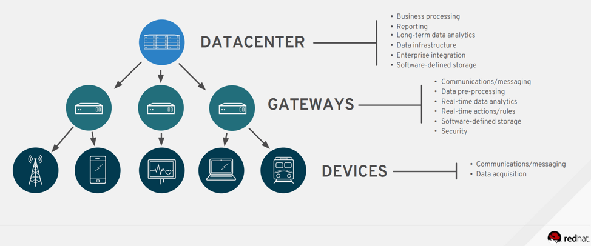

# IoT and Edge Computing

Historically, IoT embedded devices generate large amounts of data  this waste is partly due to a dogmatic default to the device-edge-cloud model. 

This approach involves the network of IoT devices sending large sums of data to a local edge computer. The edge then either processes that data to push to a cloud repository or pushes the data first for the cloud to process.

While not a one-size-fit-all, this architecture diagrams shows how some of the components unique to the IoT space fit together. 

For example, consider a small factory that needs to install sensors to monitor a manufactoring or assembly of a physical product. 

Depending on how Edge computing can provide tremendous value or increase costs by adding layers of complexity, 

## Addressing End-to-End Enterprise IoT Concerns

Edge computers add a layer of complexity to the overall compute-storage network architecture and can cause severe data latency issues. If the network is too large, sprinklers can be left on for too long, drowning the crops
Edge devices have a high number of refresh cycles, which results in ‘architecture design’ lock-in. This is an important aspect when designing the overall architecture as it restricts the amount of physical change the environment can cater for such as seasons and natural disasters.
If the farm decides to expand its network, the farmer would either have to pay large front-end costs towards installing additional edge computers or invest in stronger IoT devices to take care of greater workloads. Regardless, scalability is a nightmare.
While Edge Computing certainly has its place in IoT, the framework has been redundantly overused. Instead, engineers and developers must learn to think differently about structuring their network architecture.

What lies at the Industrial Edge?
March 07, 2019
Syed Mohsin Ali
https://technology.ihs.com/611687/what-lies-at-the-industrial-edge

While not new, the idea of Industrial Internet of Things (IIoT) has evolved over the last few years.   Driven by customer need for more connectivity, the enormous data volumes being generated has led to many new business opportunities. 

The “edge” is often referred to as the border between the data centers and networks managed by the companies Information Technology (IT) and the …

While the traditional approach to analyzing the data generated from these devices involves transferring the data to the Cloud, most manufactures have concerns with data security and are adamant about not transferring their data to the cloud. In addition, transferring data to and from the cloud requires a good deal of bandwidth and is also time-consuming. 

Given the superior processing power of present-day devices, one approach that seems to be gaining popularity is to perform the analysis the mission and time-critical analyses at the edge while the rest of the data is transferred to the cloud for analysis.
This hybrid approach provides faster response times and data protection for the mission critical data stays on the premise and can be kept safe from intrusion.

The figure below depicts the modern pyramid of automation where the data is flowing between the endpoint devices and the cloud via edge. As seen in the figure, 

 

 Content Source: 

## Enterprise IoT Architecture
In the figure, the edge networking devices provide decreased latency, energy consumption, and cost of data communication

Reference

## References

1. [Cloud State Machines: The Future of IoT and Edge Computing](
https://hackernoon.com/cloud-state-machines-the-future-of-iot-and-edge-computing-f1761c55a803)

1.	https://blog.openshift.com/wp-content/uploads/IoT-Edge-Deployments-with-OpenShift-and-RHEL.pdf

1.	Syed Mohsin Ali, “What lies at the Industrial Edge?”, March 07, 2019, https://technology.ihs.com/611687/what-lies-at-the-industrial-edge