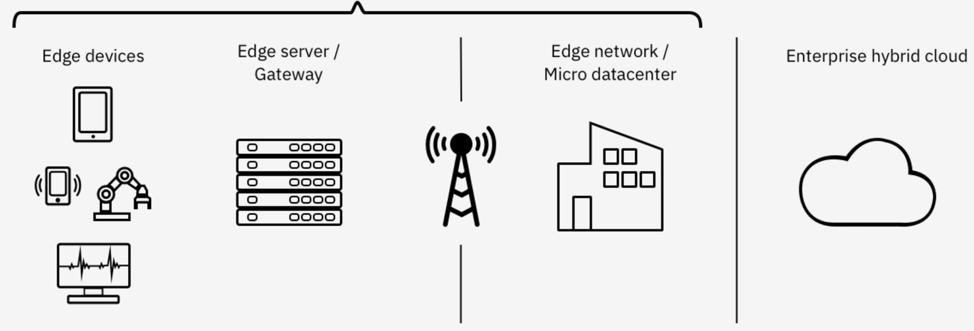

# Solution Architecture

 
## Edge Computing by

Edge computing places AI/ML and information analysis closer to where the data is created and where actions need to be taken.  While often small these devices (such as smart thermostats, smart doorbells and wearables) can be equipped with sensors and actuators that can that capture and send information by way of audio and video feeds such to upstream compute nodes

## Edge Computing Nodes

 

**Content Source:** 

Edge computing nodes can be organized as follows:

Edge Devices. Traditionally called “sensor” or “DFDSF”, newer IoT or Edge devices (smart doorbells, wearables and DDGSES to name a few). are often be equipped to collect data, apply AI rules, and sometimes store data locally. Some smart devices can often handle performing real-time. The devices could handle analysis and real-time inferencing without involvement of the edge server or the enterprise region.

Edge gateway. Edge gateways are servers that can deploy apps to the devices, collect data from IoT devices and are often in constant communication with these devices using agents 

Edge network or micro data center.  Edge networks are often locally clouds used for communicating with devices. Also because they are usually on premise or closer to the devices latency and bandwidth issues are decreased. Also, with the advent of more powerful CPUs and faster networks (5G) can assist with data analysis reducing need to transfer mission critical data to the Enterprise or public clouds for processing.

Enterprise Hybrid Cloud. The Enterprise Cloud is often a combination of services provide by  on-premise and public clouds (Hybrid Cloud) data centers. Offering enterprise-level analytics, along with compute, storage and networks, the Enterprise cloud enables the IoT to integrate with on premise data sources and public cloud services such as image recognition or sentiment analysis 

Content source: [Edge Computing Nodes](https://www.ibm.com/cloud/garage/architectures/edge-computing
)

“Edge computing brings AI and Analytics workloads closer to where data is created and actions are taken—reducing latency, decreasing network demands, increasing the privacy of personal and sensitive information, and improving operational resilience. IDC (International Data Corporation) estimates that we will see the number of intelligent edge devices in the market grow to 150 billion by 2025.”
 
Rob High, Jr., CTO IBM Edge Computing, IBM Fellow, and Vice President

Building on Red Hat’ s experience as the world’s largest open source company, this IoT architecture is designed to provide the key foundational elements that organizations need to quickly and securely roll out IoT use cases. It also lets you contain costs, and avoid vendor lock-in.
 

This architecture

## References
For more information on Edge Computing architectures checkout 
1.	[Edge Computing]( https://www.ibm.com/cloud/garage/architectures/edge-computing)
2.	[ An End-to-End Open Architecture for IoT ](https://www.cloudera.com/solutions/gallery/red-hat-eurotech-end-to-end-open-source-architecture-for-iot.html)
