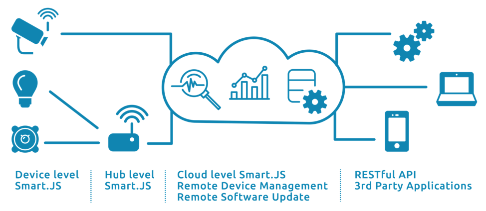
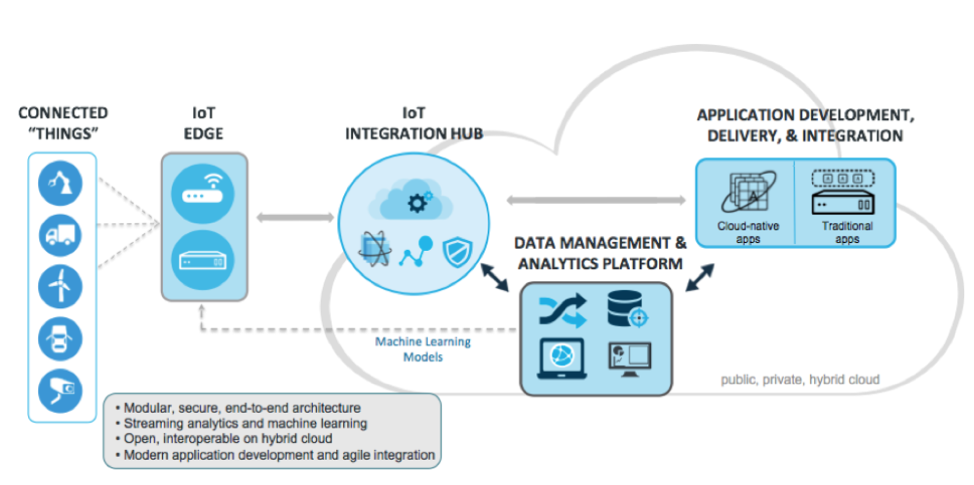

# WHat is an IoT Platform

An IoT platform is used to connect your application to the cloud and the corresponding output device. Here is an example of an IoT Platform, obtained from an IoT article published on Dzone.

**Content source:** [Iot Platform](https://dzone.com/articles/what-is-an-iot-platform)

The IoT platform ensures that the communication between your device and the output works, that data is collected and formatted correctly and functions such as remote updates and access are facilitated.
There are other components to consider such as security features, connectivity choices (WiFi, Bluetooth, etc), etc. For now, we are going to keep it topline so you get the foundation of what an IoT platform consists of.

The components that you see here are:

## Edge Device
An edge device could be as simple as an app running on an Android or IOS tablet; or as complex as a custom application running on a  microcontroller using a combinations of sensors to collect data, actuators to perform specific actions. The edge device usually has wireless connectivity to allow the application to communicate to a hub or gateway.

## Edge Gateway / Hub

The Edge Gate way, or Hub, is the software that facilitates the connection with the cloud. Typically, it is a bridge between the IP-connected cloud non-IP-connected device.

## Cloud
The cloud is where the data is sent from your device and where it should be formatted for output (graphs etc). It also facilitates remote device management and removes software updates.
3rd Party Applications
When we arrive at the far right, we have the 3rd party application where the output should be sent. This can be a mobile app or your internal systems amongst other things. This is where the data is sent.

Further Reading

 - [Iot Platform](https://dzone.com/articles/what-is-an-iot-platform)
